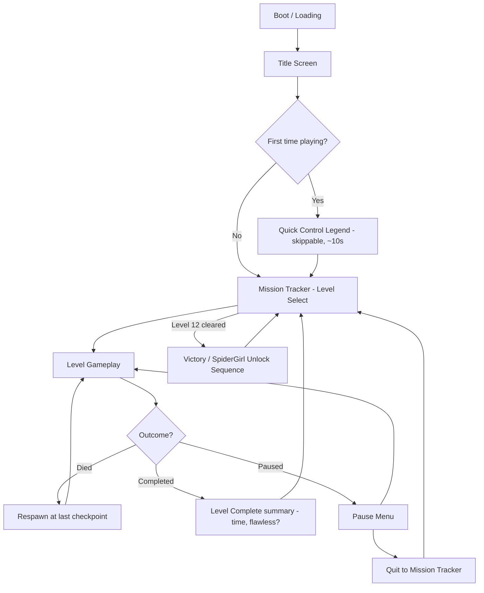
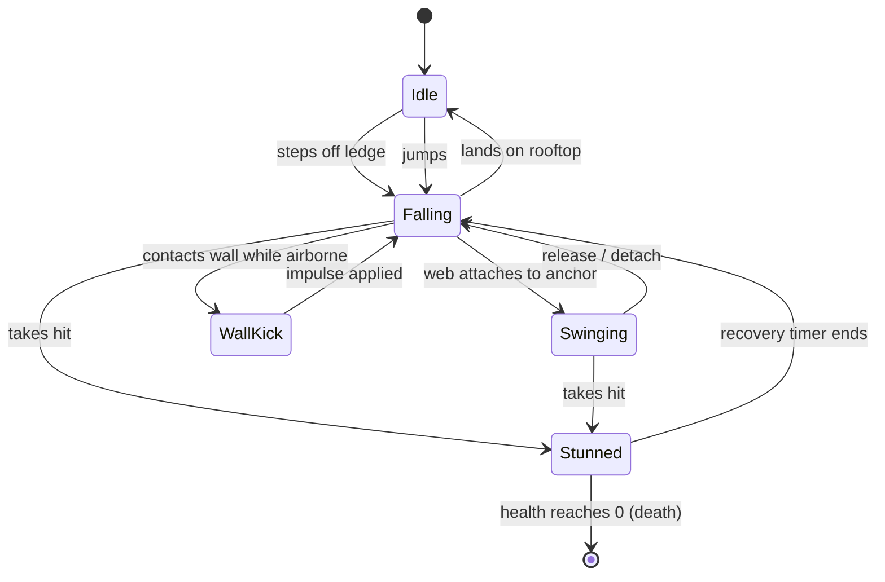
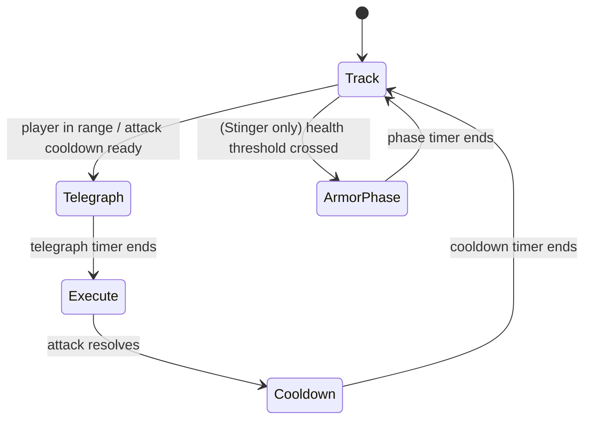

# SPIDERWEB — Full Game Design & Technical Specification
### (Working file name: Spiderman2d.md — internal project/game title: "Spiderweb")

> This is a single, self-contained specification document for a 2D web-swinging action-platformer game. It is written to be handed directly to an AI coding agent (e.g. Google Antigravity, Claude Code, Cursor, or similar) as the master build brief. It contains story, characters, mechanics, physics formulas, level-by-level data, UI specs, folder structure, flowcharts, and asset sourcing guidance — everything needed to build the game end to end without further clarification.

---

## TABLE OF CONTENTS
0. Master Build Prompt (read this first)
1. Concept & Core Pillars
2. Originality / IP Notice (important — read before generating art or names)
3. Story & World
4. Characters — Bios, Stats & Visual Specs
5. Core Mechanics — Physics Deep Dive
6. Controls Specification (Desktop + Mobile)
7. Game Flow & State Machines (flowcharts)
8. Level Design — All 12 Levels (full data tables)
9. Enemies & Bosses — Stats and AI Patterns
10. UI / HUD / Mission Tracker (Level Select) Spec
11. Progression, Save Data & Replayability
12. Audio Direction
13. Technical Architecture & Folder Structure
14. Performance & Optimization Rules
15. Accessibility Requirements
16. Asset Sourcing Guide (where to get/make resources)
17. QA / Cross-Device Testing Checklist
18. Build Roadmap (phased implementation order)
19. Final Agent Execution Instructions

---

## 0. MASTER BUILD PROMPT

Paste this block as your first message to the coding agent, then paste/attach the rest of this document as supporting context:

```
Build "Spiderweb" — a complete, playable 2D web-swinging action-platformer game
that runs in any modern browser on both desktop (mouse + keyboard) and mobile
(touch), with fast load time and zero input lag as the top priority.

Requirements:
- Pure HTML5 Canvas + vanilla JavaScript (ES modules). No game engine, no
  external asset downloads, no build step required to run it.
- All visuals (skyline, characters, effects) are drawn procedurally with
  canvas primitives and simple sprite sheets — no large image/video assets.
- Implement the hand-tuned pendulum swing physics exactly as specified in
  Section 5 (do not use a full physics engine/library).
- Implement all 12 levels exactly as specified in Section 8, difficulty
  strictly increasing from Level 1 (already hard, no tutorial combat).
- Implement all enemies and the 3 boss fights exactly as specified in
  Section 9, including health bars, telegraphed attacks, and phase changes.
- Implement the Mission Tracker level-select screen exactly as specified in
  Section 10.
- Implement save/progress data using localStorage exactly as the schema in
  Section 11.
- Follow the folder structure in Section 13 exactly.
- Follow the performance rules in Section 14 and accessibility rules in
  Section 15 without exception.
- Use only original character names, colors, and designs as specified in
  Section 4 — do not reference or reproduce any existing copyrighted
  superhero franchise, character likeness, or trademarked names.
- Source or generate placeholder art/audio using only the methods in
  Section 16 (procedural canvas art + free/CC0 resources or self-generated
  8-bit audio). Do not use copyrighted third-party game assets.

Work in the phased order given in Section 18. After each phase, verify the
result actually runs in a browser (load the page, exercise the mechanic)
before moving to the next phase.
```

---

## 1. CONCEPT & CORE PILLARS

**Genre:** 2D side-scrolling web-swinging action-platformer, hard-difficulty, level-based (not endless/procedural).

**Platforms:** Single codebase, runs identically in desktop browsers and mobile browsers (no separate native builds).

**The 5 non-negotiable pillars, in priority order:**
1. **Fast load** — page interactive in under ~2 seconds on a normal connection, ideally with almost zero external asset downloads.
2. **Zero perceived lag** — stable 60fps, frame-independent physics, no input delay on tap/click.
3. **Cross-device parity** — identical mechanics and difficulty on mobile touch and desktop mouse/keyboard.
4. **Hard from Level 1** — no easy on-ramp level; difficulty escalates every level from an already-challenging baseline.
5. **Cinematic action feel** — swing-strike combat, boss health bars, telegraphed attacks, and a rescue payoff (SpiderGirl), inspired by the *tone* of modern superhero films — not their specific characters or plots.

---

## 2. ORIGINALITY / IP NOTICE

This game is **inspired by** the web-swinging superhero genre but must use **100% original characters, names, and visual designs**. Do not use Spider-Man, Marvel, or any other studio's copyrighted character names, costumes, logos, or likenesses anywhere in code, art, or text.

- Hero name **"Jax Steele"**, villain names **"Stinger," "The Enforcer," "Thread"** are original and safe to use as-is.
- The heroine name **"SpiderGirl"** was the original creative pick for this project. Note for the record: this name has some overlap with an existing trademarked comic-book character. It's your call as project owner, but if you want the design to be fully clear of any overlap, consider an alternate original codename (e.g. **"Vesper"**) while keeping her exact pink/white/black visual design, which is already original. This document uses "SpiderGirl" throughout per your direction — swap the string everywhere if you change your mind later; it's a single find-and-replace.
- All sprites, backgrounds, and sounds must be either procedurally drawn/generated or sourced from properly licensed free/CC0 material per Section 16 — never traced or ripped from existing Spider-Man games, movies, or comics.

---

## 3. STORY & WORLD

**Setting:** A modern city skyline, told across rooftops (the entire game takes place above street level — you never touch the ground).

**Premise:** Years ago, a masked protector vanished after a rooftop battle went publicly wrong. The city moved on, sponsored a flashier corporate-backed hero, and genuinely forgot he existed. Now he's forced back into the suit.

**Inciting Incident:** During a prison transport, a scorpion-themed mercenary named **Stinger** breaks loose and starts tearing through the city's rooftops. No one else can stop him.

**Act 1 (Levels 1–2):** The hero, rusty and doubting himself, relearns his own limits under real pressure — heavy traversal, first hazards, no combat yet.

**Act 2 (Levels 3–5):** Stinger's mercenary crews take over rooftop territory. Swing-strike combat unlocks. Corporate security drones start treating the hero as a threat, not an ally.

**Act 2.5 (Level 6 — Mini-Boss):** **The Enforcer**, Stinger's top lieutenant, is sent to end the hero's comeback for good.

**Act 3 (Levels 7–9):** Night falls on the story — tone darkens, hazards intensify, and background billboards/news screens start flickering with hints that someone else is directing Stinger from the shadows (an unseen mastermind, left as a sequel hook — never shown on-screen in this game).

**Act 3.5 (Level 10 — Mini-Boss):** **Thread**, a fast, agile rival web-user working for the same shadow employer, tests the hero's reflexes hard before the finale.

**Act 4 (Level 11):** A storm rolls in. The densest gauntlet in the game — pure survival and precision, building tension toward the finale.

**Climax (Level 12 — Final Boss):** Two-phase showdown with **Stinger** on a rooftop arena. Defeating him reveals he was holding **SpiderGirl** captive the entire time. She's freed. The city's news tickers finally start crediting the hero by name again — the "brand new day" beat, told entirely through environmental storytelling (news-card popups), not cutscenes.

**Epilogue:** "SpiderGirl Unlocked" screen. She becomes playable in Free Play / New Game+ with her own moveset (Section 4). A final news-ticker line teases the still-unseen mastermind, left open for a sequel.

**Story delivery method:** Between-level "Breaking News" popup cards (a stylized phone/news-alert graphic with 1–2 lines of in-world text), never full animated cutscenes — keeps load time and file size minimal while still delivering narrative beats.

Example news-card lines (write more like these, all original):
- *"Rooftop chaos reported downtown — witnesses describe a masked figure in navy and teal."*
- *"Security firm denies any connection to last night's rooftop incident."*
- *"Who is he? City records show no match for the vigilante's description."*
- *"Sightings increase across the skyline — some are calling him 'Spiderweb.'"*

---

## 4. CHARACTERS — BIOS, STATS & VISUAL SPECS

### 4.1 Jax Steele ("Spiderweb") — Player Hero (default)
- **Suit colors:** Deep navy blue (`#1B2A4A`) primary, electric teal (`#2FE3D6`) accents, geometric web-pattern (straight lines, not organic curls) for readability at small pixel sizes.
- **Power source:** Experimental grapple-tech suit (not a spider-bite origin) — justifies suit upgrades and unlockable variants later.
- **Base stats:** Health 100. Swing speed: baseline (multiplier ×1.0). Damage per swing-strike: baseline (×1.0). Special: none (unlocks suit upgrades post-launch, out of scope for v1).
- **Personality:** Rusty, sarcastic under pressure, self-doubting but determined — used only in optional between-level news-card flavor text, no voice acting needed.

### 4.2 SpiderGirl — Unlockable Second Playable Character
- **Suit colors:** Pink (`#FF3D8A`) primary, white (`#F5F5F5`) side panels, black (`#111111`) web-pattern detailing.
- **Base stats:** Health 80 (lower). Swing speed: ×1.2 (faster). Damage per swing-strike: ×0.8 (weaker). Special move: short-range "web-zip" dash (quick burst of horizontal speed, small cooldown) — gives her a genuinely different feel from Jax, not a reskin.
- **Unlock condition:** Defeat Stinger (Level 12) once.

### 4.3 Stinger — Final Boss (Level 12)
- **Look:** Bulky armored exosuit, dark bronze (`#7A5230`) and black (`#161616`), mechanical scorpion tail as primary weapon.
- **Health:** 100 (Phase 1: 100→50, Phase 2: 50→0, faster/more aggressive).
- **Attacks:** Tail Lash (wide sweep, 0.6s telegraph), Poison Lunge (fast dash-attack, 0.4s telegraph), Armor Phase (3s temporary invulnerability, spawns 2 mini-drones in Phase 2 only).

### 4.4 The Enforcer — Mini-Boss (Level 6)
- **Look:** Heavy melee brute, dark grey/red armor plating, no ranged attacks — pure telegraphed melee pressure to teach boss-pattern reading before Stinger.
- **Health:** 60. **Attacks:** Charge Slam (1.0s telegraph, wide hitbox), Ground Pound (0.5s telegraph, radial hitbox, punishes standing still).

### 4.5 Thread — Mini-Boss (Level 10)
- **Look:** Fast, agile rival web-user, purple (`#5B2A86`) and black palette to visually contrast both Jax and Stinger.
- **Health:** 70. **Attacks:** Web-Snare (thrown projectile that briefly roots the player if hit, 0.3s telegraph — short window, rewards fast reaction), Aerial Dive (mobility-based swoop attack, punishes slow/predictable swinging).

### 4.6 Standard Enemy Roster
| Type | Introduced | Health | Behavior |
|---|---|---|---|
| Drone | Level 2 | 1 hit | Patrols fixed air lane, fires slow telegraphed shot |
| Merc | Level 3 | 1 hit | Stands on rooftop, defeated by swing-strike |
| Sniper Merc | Level 4 | 1 hit | Stationary, laser-line telegraph before firing |
| Elite Merc | Level 5+ | 2 hits | Tougher version of Merc, often paired with drones |

---

## 5. CORE MECHANICS — PHYSICS DEEP DIVE

### 5.1 Why a hand-tuned formula, not a physics engine
Full rope/physics simulations (recalculating forces every frame with a general-purpose solver) are the #1 cause of the "web physics fall apart at normal speed" bug seen in most fan-made Spider-Man games. Instead, Spiderweb uses a **closed-form pendulum formula** — cheap to compute (a few trig calls per frame), numerically stable at any frame rate, and easy to hand-tune for game feel.

### 5.2 Swing state — reference formulas (pseudocode)
```
On web attach (player presses/taps while airborne and a valid anchor is found):
    anchor = {x, y}                     // nearest valid rooftop edge within range
    dx = player.x - anchor.x
    dy = player.y - anchor.y
    ropeLength = sqrt(dx*dx + dy*dy)     // clamp to [ropeLengthMin, ropeLengthMax]
    theta = atan2(dx, dy)                // angle from straight-down vertical
    angularVelocity = (carry over some of player's pre-attach velocity, projected
                       into tangential component, for smooth transitions)

Every frame while swinging (dt = seconds since last frame, clamped to avoid spikes):
    // pendulum restoring force
    angularAccel = -(gravityAccel / ropeLength) * sin(theta)

    // player "pumping" input adds/removes energy
    if (inputDirection != 0):
        angularAccel += inputDirection * pumpTorque

    angularVelocity += angularAccel * dt
    angularVelocity *= angularDamping     // slight damping so energy doesn't grow forever
    angularVelocity = clamp(angularVelocity, -maxAngularVelocity, maxAngularVelocity)

    theta += angularVelocity * dt

    player.x = anchor.x + ropeLength * sin(theta)
    player.y = anchor.y + ropeLength * cos(theta)

On release (player lifts finger / releases click):
    vx = ropeLength * cos(theta) * angularVelocity
    vy = -ropeLength * sin(theta) * angularVelocity
    player.velocity = (vx, vy)            // becomes normal projectile motion under gravity
    state = "falling"
```

### 5.3 Free-fall / non-swinging state
```
Every frame while falling/jumping (not attached):
    player.velocity.y += freeFallGravity * dt
    player.velocity.y = min(player.velocity.y, maxFallSpeed)
    player.x += player.velocity.x * dt
    player.y += player.velocity.y * dt
```

### 5.4 Wall-kick
```
If player is airborne, moving toward a wall, and within wallKickRange of it:
    on input tap toward the wall (or auto-trigger on contact):
        player.velocity.x = -player.velocity.x * wallKickBounceFactor + wallKickImpulse
        player.velocity.y = -wallKickUpwardImpulse
```

### 5.5 Anchor auto-snap (assist aiming)
```
On aim input at screen point P:
    worldP = screenToWorld(P)
    candidates = all building-top corners and flagpole tips within anchorSearchRadius
                 of worldP AND within maxWebRange of player.position
    if candidates is empty: do nothing (small "no target" flash, no attach)
    else: attach to the candidate closest to worldP
```

### 5.6 Swing-strike combat
```
On collision between player and enemy/boss hitbox while player.state == "swinging"
or "falling" with speed >= swingStrikeSpeedThreshold:
    deal damage to enemy/boss
    apply small hit-stop (freeze both for ~60-80ms)
    apply knockback + screen shake (respect "reduce shake" accessibility setting)
```

### 5.7 Reference default constants (tune during playtesting)
| Constant | Suggested default | Notes |
|---|---|---|
| gravityAccel (pendulum) | 1800 px/s² | Controls swing arc weight |
| freeFallGravity | 2200 px/s² | Slightly heavier than swing gravity, feels snappier |
| maxFallSpeed | 1400 px/s | Terminal velocity cap |
| ropeLengthMin / Max | 120 / 480 px | Min/max web length |
| angularDamping | 0.999 per frame @60fps | Prevents infinite energy build-up |
| pumpTorque | 6.0 rad/s² | Strength of player-driven pumping |
| maxAngularVelocity | 4.5 rad/s | Speed cap on the swing itself |
| wallKickImpulse / upward | 500 / 700 px/s | Wall-kick launch strength |
| swingStrikeSpeedThreshold | 600 px/s | Minimum speed to deal contact damage |
| anchorSearchRadius | 90 px (desktop) / 130 px (touch) | Larger on touch for finger imprecision |
| maxWebRange | 520 px | Max distance a web can reach an anchor |

### 5.8 Frame timing rule
All physics must be updated using **delta-time**, not fixed per-frame increments, and `dt` must be clamped (e.g. max 1/30s per step) so that a dropped frame or tab-switch never causes a physics "spiral of death" or a sudden teleport.

---

## 6. CONTROLS SPECIFICATION

### 6.1 Desktop
- **Aim + Fire Web:** Mouse position = aim point. Left-click and hold = fire/attach web at nearest valid anchor near cursor, holds swing while held.
- **Release:** Release left-click = detach, go airborne.
- **Directional pump/influence:** A/D or Left/Right arrow keys while swinging.
- **Wall-kick:** Automatic on approach to a wall while airborne (no separate key needed).
- **Pause:** Esc or P.

### 6.2 Mobile (touch)
- **Primary touch (anywhere on canvas):** Same as mouse — tap-and-hold = aim/attach at nearest anchor near touch point; lift finger = release.
- **Secondary touch — two small semi-transparent buttons, bottom-left and bottom-right corners:** directional pump/influence while swinging (equivalent to A/D). Implemented via multi-touch so the primary swing touch is never interrupted.
- **Wall-kick:** Automatic, same as desktop.
- **Orientation:** Landscape only. If the device is in portrait, show a full-screen "Rotate your device" overlay with a simple rotating-phone icon; pause the game underneath.

### 6.3 Universal rules
- No control requires precise pixel accuracy — anchor auto-snap absorbs aiming imprecision on both input types.
- No control scheme differs in capability between desktop and mobile — full parity, per Pillar 3.

---

## 7. GAME FLOW & STATE MACHINES

### 7.1 Overall game flow


### 7.2 Player state machine


### 7.3 Boss AI pattern loop (applies to all 3 bosses, timings differ per boss)


---

## 8. LEVEL DESIGN — ALL 12 LEVELS

General rule: difficulty increases via gap width, enemy density, telegraph speed, hazard count, and checkpoint spacing — never via adding new control complexity. Checkpoints give near-instant respawn with brief post-respawn invulnerability.

| # | Name | World Length (px) | Rooftop Gap Range (px) | Checkpoints | Enemies Introduced | Hazards | Notes |
|---|---|---|---|---|---|---|---|
| 1 | No Warm-Up | 4000 | 150–220 | 2 | Drone (x2) | none | Control legend shown once before this level |
| 2 | Wind Corridor | 4500 | 170–240 | 2 | Drone (x4, paired fire) | Wind gusts | First swing-arc interference |
| 3 | Turf War | 5000 | 160–230 | 3 | Merc (clusters of 2-3) | Crumbling rooftops | Swing-strike combat unlocked here |
| 4 | Crossfire | 5200 | 170–240 | 3 | Sniper Merc + Merc + Drone | Fire/explosion zones | First multi-threat level |
| 5 | Construction Chaos | 5500 | 180–250 | 3 | Merc squads | Moving crane arms/girders | Precision timing focus |
| 6 | The Enforcer (Mini-Boss) | 2500 (arena) | n/a | 1 (pre-fight) | The Enforcer | none | Boss health bar debut |
| 7 | Night Ops | 5800 | 190–260 | 3 | Elite Merc, faster Drones | Sweeping searchlights, low visibility | Tone shifts darker |
| 8 | Static in the Signal | 6000 | 200–270 | 2 | Elite Merc + Sniper Merc | Flickering billboards (story only, no damage) | Tightest gaps yet before Level 9 |
| 9 | Rooftop Siege | 6200 | 200–280 | 2 | Full mixed roster | Crumbling roofs + fire zones + cranes | Toughest non-boss gauntlet |
| 10 | Thread (Mini-Boss) | 2500 (arena) | n/a | 1 (pre-fight) | Thread | none | Mobility-punishing boss |
| 11 | The Approach | 6500 | 210–290 | 2 | Full mixed roster, dense | Heavy wind, lightning flash (respect accessibility toggle) | Densest gauntlet, pure survival |
| 12 | Stinger Showdown (Final Boss) | 3000 (arena) | n/a | 1 (pre-fight) | Stinger (2 phases) | Mini-drone summons (Phase 2 only) | SpiderGirl reveal on victory |

### 8.1 Example level-data JSON schema (data-driven level definitions)
```json
{
  "levelId": 1,
  "name": "No Warm-Up",
  "worldLength": 4000,
  "buildingGapRange": [150, 220],
  "buildingHeightRange": [220, 520],
  "checkpoints": [1400, 2800],
  "enemies": [
    { "type": "drone", "count": 2, "patrolRangeX": [900, 1500] }
  ],
  "hazards": [],
  "musicCue": "level_theme_1",
  "isBossLevel": false
}
```
Boss levels use an additional `"boss"` object instead of/alongside `enemies`:
```json
{
  "levelId": 6,
  "name": "The Enforcer",
  "isBossLevel": true,
  "boss": {
    "type": "the_enforcer",
    "health": 60,
    "attacks": [
      { "name": "charge_slam", "telegraphMs": 1000, "cooldownMs": 2500 },
      { "name": "ground_pound", "telegraphMs": 500, "cooldownMs": 2000 }
    ]
  }
}
```

---

## 9. ENEMIES & BOSSES — STATS AND AI PATTERNS

### 9.1 Standard enemies (full stat block)
| Type | Health | Contact Damage | Attack | Telegraph | Notes |
|---|---|---|---|---|---|
| Drone | 1 | 10 | Slow projectile | 0.5s | Destroyed by swing-strike |
| Merc | 1 | 15 | Melee on contact | none (stationary threat) | Destroyed by swing-strike |
| Sniper Merc | 1 | 20 | Laser-line shot | 0.8s (visible laser line) | Stationary, high telegraph clarity |
| Elite Merc | 2 | 20 | Melee + short dash | 0.4s | Requires 2 swing-strikes |

### 9.2 Boss detail — see Section 4.3–4.5 for lore/visuals. Mechanical summary:
| Boss | Health | Phases | Key Mechanic |
|---|---|---|---|
| The Enforcer | 60 | 1 | Pure telegraphed melee, teaches pattern-reading |
| Thread | 70 | 1 | Punishes slow/predictable swinging, root-projectile |
| Stinger | 100 | 2 (split at 50%) | Phase 2 adds speed + mini-drone summons |

### 9.3 Boss damage rule
Bosses only take damage from a swing-strike (Section 5.6) landed during a non-invulnerable window. Armor Phase (Stinger) and any future boss invulnerability windows must be visually distinct (color tint change) so the "don't attack now" signal is always fair and readable.

---

## 10. UI / HUD / MISSION TRACKER SPEC

### 10.1 In-level HUD
- **Top-left:** Player health bar, segmented, navy/teal palette (or pink/white/black when playing SpiderGirl).
- **Top-center:** Boss health bar + boss name label — visible only during boss encounters (Levels 6, 10, 12).
- **Top-right:** Distance/progress counter for the current level.
- **Bottom corners (mobile only):** Semi-transparent directional buttons (Section 6.2).

### 10.2 Mission Tracker (Level Select) screen
A retro pixel-framed "tracker" style screen, fully original art (no real maps, logos, or photos):
- **Thick pixel-art bezel border**, navy/teal, with corner rivet details.
- **Top bar:** Blocky pixel-font title "SPIDERWEB: MISSION TRACKER." Top-left: circular hero-icon button (opens stats/profile). Top-right: spider-emblem icon button (opens Settings, including the accessibility toggle from Section 15).
- **Main area:** A stylized top-down rooftop skyline (matches in-game art style) with a glowing teal web-strand path connecting 12 level nodes in sequence.
- **Node states:** Locked (greyed badge + padlock) / Completed (filled badge, glow, checkmark) / Current (pulsing, brightest glow) / Mini-boss nodes (distinct emblem shape for Levels 6 & 10) / Final boss node (largest marker, scorpion-tail emblem, Level 12).
- **Info popup on node tap/click:** Level name, best time (if replayed), "Flawless" badge if earned, and a "DEPLOY" button to start/replay that level.
- **Bottom ticker bar:** Scrolling in-world news headlines (Section 3 examples), purely atmospheric.
- **Bottom-left corner:** Small pixel portrait of current playable character (Jax by default; swappable to SpiderGirl once unlocked).
- **Bottom-right corner:** Small web-shaped radar dial that fills as optional hidden collectibles are found across levels (purely a completionist tracker, never gates progress).

---

## 11. PROGRESSION, SAVE DATA & REPLAYABILITY

### 11.1 Save system
All progress is stored client-side via `localStorage` — no login/account/server required, so it never adds load-time latency.

### 11.2 Save data schema
```json
{
  "version": 1,
  "unlockedLevel": 4,
  "spiderGirlUnlocked": false,
  "levels": {
    "1": { "completed": true, "bestTimeMs": 54210, "flawless": true },
    "2": { "completed": true, "bestTimeMs": 61890, "flawless": false },
    "3": { "completed": false, "bestTimeMs": null, "flawless": false }
  },
  "collectibles": { "found": 4, "total": 24 },
  "settings": {
    "reduceFlash": false,
    "reduceShake": false,
    "sfxVolume": 0.8,
    "musicVolume": 0.6
  }
}
```

### 11.3 Replayability features
- **Level select** — any reached level can be replayed anytime from the Mission Tracker.
- **Best-time tracking** — local only, encourages speedrunning tight levels.
- **"Flawless" badges** — awarded for completing a level without taking damage.
- **Optional collectibles** — rescued-civilian style pickups tucked into levels; purely optional, feed the radar dial in Section 10.2, never gate progression.

---

## 12. AUDIO DIRECTION

- **Style:** Lightweight chiptune/synth score — small file size, instant load, matches pixel-art tone.
- **Music cues needed:** main theme (title/tracker), 3–4 rotating level themes (reused across similar levels), a distinct tension sting for boss intros, a triumphant swell for the SpiderGirl reveal.
- **SFX needed:** web-thwip (fire), swing whoosh (looping while swinging, pitch tied to speed), landing thud, hit impact (player and enemy variants), enemy defeat pop, boss telegraph cue (audio warning, doubles as an accessibility aid for players who react better to sound than visual telegraphs), UI click/confirm.
- **No long compressed audio tracks** — prefer short loops and generated 8-bit SFX (see Section 16.3) to keep total audio payload minimal.

---

## 13. TECHNICAL ARCHITECTURE & FOLDER STRUCTURE

### 13.1 Stack
Vanilla JavaScript (ES modules), HTML5 Canvas 2D context, no bundler required to run (a bundler/minifier is optional for production but the game must run by simply opening `index.html` in dev). No external runtime dependencies/libraries.

### 13.2 Folder structure
```
spiderweb/
├── index.html                 # entry point, canvas element, loading screen markup
├── style.css                  # full-screen canvas layout, HUD overlay CSS, orientation-lock overlay
├── README.md                  # how to run locally, how to add a level
│
├── src/
│   ├── main.js                 # boots the game, owns the top-level state machine (Section 7.1)
│   │
│   ├── engine/
│   │   ├── gameLoop.js         # requestAnimationFrame loop, delta-time clamping
│   │   ├── input.js             # unified mouse/touch/keyboard input handling (Section 6)
│   │   ├── physics.js           # pendulum swing + free-fall + wall-kick formulas (Section 5)
│   │   ├── camera.js            # follows player, parallax layer offsets
│   │   └── collision.js         # AABB/circle collision helpers
│   │
│   ├── entities/
│   │   ├── player.js            # Jax / SpiderGirl shared entity, stat-driven by active character
│   │   ├── enemies.js           # Drone, Merc, Sniper Merc, Elite Merc classes
│   │   └── bosses.js            # The Enforcer, Thread, Stinger — AI pattern state machines (Section 7.3)
│   │
│   ├── world/
│   │   ├── buildings.js         # procedural skyline generation, anchor-point extraction
│   │   ├── hazards.js           # wind, crumbling roofs, fire zones, cranes, searchlights, lightning
│   │   └── levels/
│   │       ├── level01.json      # data-driven level definitions (Section 8.1 schema)
│   │       ├── level02.json
│   │       ├── ...
│   │       └── level12.json
│   │
│   ├── ui/
│   │   ├── hud.js               # in-level HUD (Section 10.1)
│   │   ├── missionTracker.js     # level-select screen (Section 10.2)
│   │   ├── menus.js             # title screen, pause menu, settings, control legend
│   │   └── newsCards.js          # between-level story popups (Section 3)
│   │
│   ├── audio/
│   │   └── audioManager.js       # loads/plays music + SFX, respects volume settings
│   │
│   └── save/
│       └── saveManager.js        # localStorage read/write, schema in Section 11.2
│
└── assets/
    ├── sprites/                  # only if using drawn sprite sheets rather than pure procedural shapes
    ├── audio/                    # music/SFX files (kept minimal per Section 12)
    └── fonts/                    # pixel-style font files or @font-face CDN references
```

### 13.3 Canvas & resolution rules
- Design at a **logical resolution of 1280×720** (16:9 landscape). Scale the canvas to fit the actual screen via CSS transform/`devicePixelRatio`, letterboxing (black bars) on non-matching aspect ratios rather than stretching.
- Force landscape orientation on mobile (Section 6.2 rotate-device overlay).

---

## 14. PERFORMANCE & OPTIMIZATION RULES

- **Object pooling** for projectiles and particle effects — never allocate new objects every frame.
- **Off-screen culling** — buildings, enemies, and hazards outside the camera view (plus a small margin) are skipped in the render loop and removed from active arrays once far enough behind the camera, to avoid memory growth over a long level.
- **Capped particle counts** — hard ceiling per effect (e.g. max 20 particles per hit-impact burst).
- **Delta-time clamping** — see Section 5.8.
- **Zero large image/video assets** — art is procedural canvas drawing wherever possible (see Section 16.1).
- **Preload only what's needed for the current screen** — the Mission Tracker doesn't need level 12's boss assets loaded, and vice versa.
- **Target 60fps on mid-range mobile hardware** — profile on an actual mid-tier Android device, not just desktop Chrome, before calling any level "done."

---

## 15. ACCESSIBILITY REQUIREMENTS

- **Photosensitivity notice** on first launch, mentioning that Levels 5, 7, and 11 contain flashing/strobing lights.
- **"Reduce Flash" and "Reduce Screen Shake" toggles** in Settings (accessible from the Mission Tracker top-right icon per Section 10.2) — when enabled, replace screen-flash effects with a gentler fade and cap/remove camera shake.
- **Audio telegraph cues** for all boss attacks (Section 12) so timing-critical moments aren't purely visual.
- **No control requiring precise timing under 200ms** without a corresponding generous input-buffer window (e.g. buffer wall-kick/attach inputs for ~100ms so slightly-early or slightly-late taps still register).

---

## 16. ASSET SOURCING GUIDE

**Guiding rule:** never use, trace, or rip assets from existing Spider-Man games/movies/comics. Everything below is either generated by your own code, drawn by you/a freelancer to this doc's exact color specs, or sourced from properly licensed free/open resources.

### 16.1 Procedural art (recommended default — fastest load, zero licensing risk)
Draw the skyline, characters, webs, and effects directly with Canvas primitives (rectangles, arcs, paths, gradients) using the exact hex colors specified in Section 4. This is how the original reference screenshots' skyline style can be replicated cheaply — it's mostly flat-colored rectangles and simple silhouettes, not detailed pixel-art image files.

### 16.2 If you want hand-drawn pixel-art sprites instead
- **Piskel** (piskelapp.com) — free, browser-based pixel-art editor, exports sprite sheets directly. Best option for drawing Jax/SpiderGirl/Stinger/etc. to this doc's exact palettes yourself.
- **Aseprite** (aseprite.org) — the industry-standard paid pixel-art tool (~$20 one-time), if you want more advanced animation/onion-skinning features.
- **LibreSprite** (github.com/LibreSprite/LibreSprite) — free, open-source alternative to Aseprite.
- **Kenney.nl** (kenney.nl/assets) — huge library of CC0 (no attribution required) game asset packs — great for generic UI icons, tile textures, and background elements to recolor; not for the named hero/villain characters themselves (those should be original to keep the cast unique).
- **OpenGameArt.org** — filter by CC0 or CC-BY license; useful for generic "superhero-style" base sprites that can be recolored to match Section 4's palettes, or for background/environment tiles.

### 16.3 Audio
- **Freesound.org** — filter by CC0 license for one-off SFX (impacts, whooshes, UI clicks).
- **OpenGameArt.org (audio section)** — chiptune loops and SFX packs, filter by license.
- **jsfxr / sfxr-style tools** (search "jsfxr" or "bfxr") — generate original 8-bit sound effects instantly in-browser; since you generate the output yourself, there's no licensing question at all, and it fits the "lightweight, fast-load" goal perfectly (these can even be generated procedurally at runtime instead of shipped as files).

### 16.4 Fonts
- **Google Fonts** (fonts.google.com) — free, open-license, loadable via a fast CDN link with no download step. Good pixel-style options: **"Press Start 2P,"** **"VT323,"** **"Silkscreen,"** **"Pixelify Sans."**

### 16.5 Commissioning original art
If you'd rather not draw the characters yourself, this entire document (especially Sections 3 and 4) is written to be handed directly to a freelance pixel artist (e.g. via Fiverr or Upwork) as a complete, unambiguous brief.

---

## 17. QA / CROSS-DEVICE TESTING CHECKLIST

- [ ] Runs at stable 60fps on a mid-range Android phone (not just desktop Chrome).
- [ ] Touch controls tested on both iOS Safari and Android Chrome (audio autoplay policies differ — audio must start only after a user gesture).
- [ ] Portrait-mode rotate overlay triggers correctly and un-pauses cleanly on rotation back to landscape.
- [ ] Swing physics feel identical (same constants, same frame-independent behavior) at 30fps, 60fps, and 120fps displays.
- [ ] All 12 levels completable without a single instance of getting stuck / falling into an unrecoverable position.
- [ ] Save data persists correctly across a browser refresh and a full tab close/reopen.
- [ ] Every boss attack has a clearly readable visual AND audio telegraph.
- [ ] Reduce Flash / Reduce Shake settings visibly change Levels 5, 7, 11, and all three boss fights.
- [ ] No memory growth over a 10-minute continuous play session (check via browser dev tools).

---

## 18. BUILD ROADMAP (phased implementation order)

1. **Phase 1 — Core loop:** Canvas boot, game loop with delta-time, procedural skyline generation, camera follow. No player yet — just confirm a smooth-scrolling world renders at 60fps.
2. **Phase 2 — Movement & swing physics:** Implement Section 5 in full (swing, free-fall, wall-kick, anchor auto-snap). Build Level 1 only. Verify it feels good on both mouse and touch before continuing.
3. **Phase 3 — Hazards & Level 2:** Wind gusts, drones (dodge-only). Confirm difficulty escalation feels intentional, not just "more stuff."
4. **Phase 4 — Combat:** Swing-strike mechanic, Mercs, health system, Levels 3–5.
5. **Phase 5 — First boss:** The Enforcer (Level 6) — full boss AI state machine, boss health bar UI.
6. **Phase 6 — Mid-late levels:** Levels 7–9, sniper mercs, elite mercs, searchlights, news-card story beats.
7. **Phase 7 — Second boss:** Thread (Level 10).
8. **Phase 8 — Finale:** Level 11, then Stinger two-phase fight (Level 12), SpiderGirl reveal + unlock sequence.
9. **Phase 9 — Meta systems:** Save/load, Mission Tracker screen, settings/accessibility toggles, best-time and flawless tracking.
10. **Phase 10 — Polish pass:** Audio, hit-stop/screen-shake feel, performance profiling on real mobile hardware, full QA checklist (Section 17).

---

## 19. FINAL AGENT EXECUTION INSTRUCTIONS

1. Read this entire document before writing any code.
2. Build in the phased order from Section 18 — do not skip ahead to later levels/bosses before earlier phases are verified working.
3. After each phase, actually run the game in a browser and exercise the new mechanic before moving on — do not assume code compiling means it plays correctly.
4. Treat every numeric constant in Section 5.7 and every table in Sections 8–9 as the source of truth for level/enemy data — implement them as data (JSON), not hard-coded magic numbers, so future rebalancing doesn't require touching engine code.
5. If any instruction in this document seems to conflict with making the game fast-loading or lag-free (Section 1 pillars 1–2), the fast/lag-free requirement wins — flag the conflict rather than silently adding heavy assets or a physics engine.
6. Do not introduce any copyrighted third-party character names, logos, or art at any point (Section 2).
